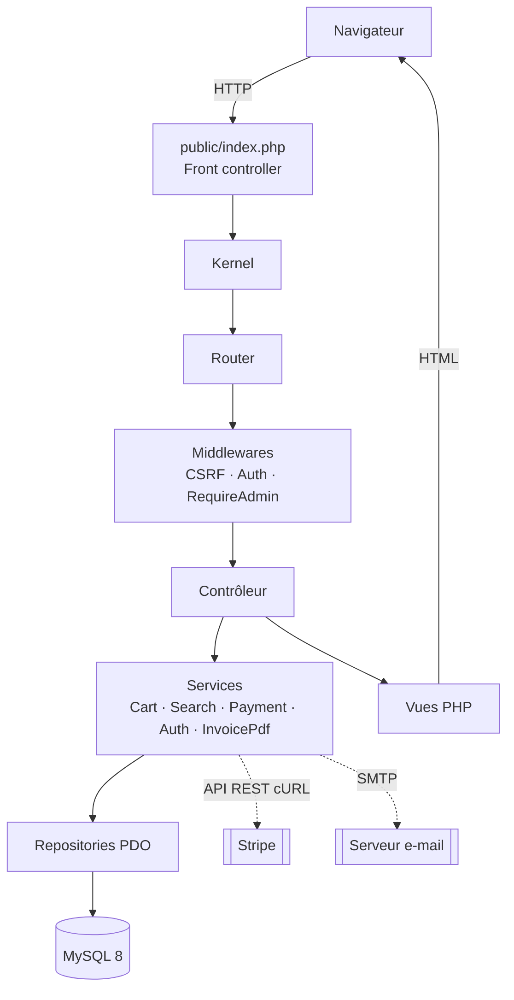
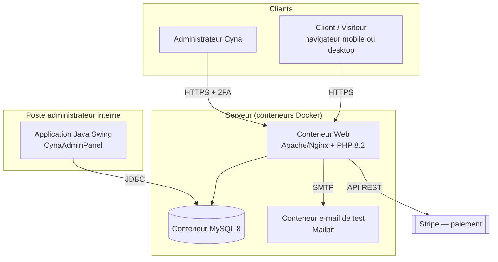
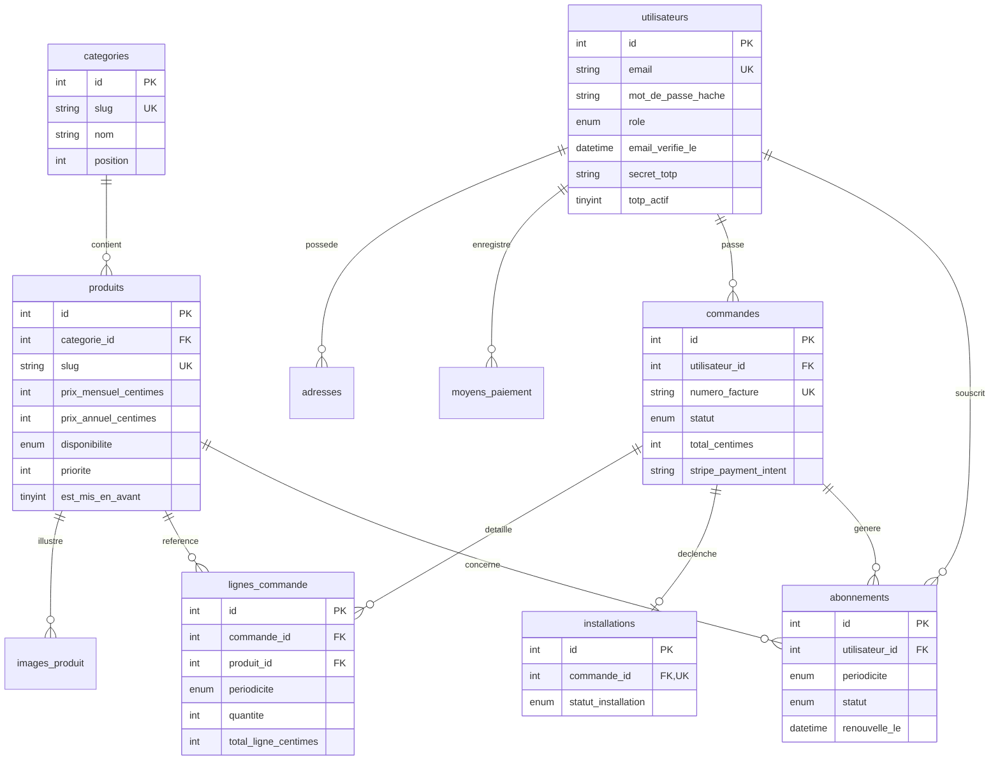
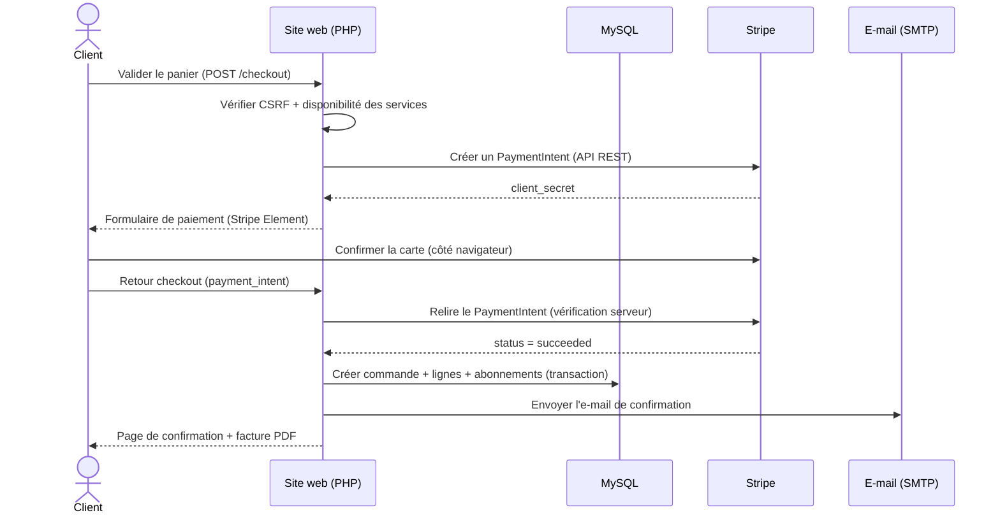
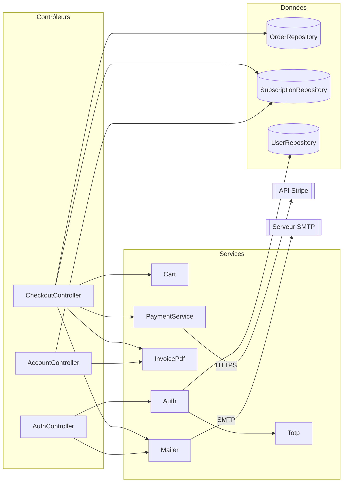
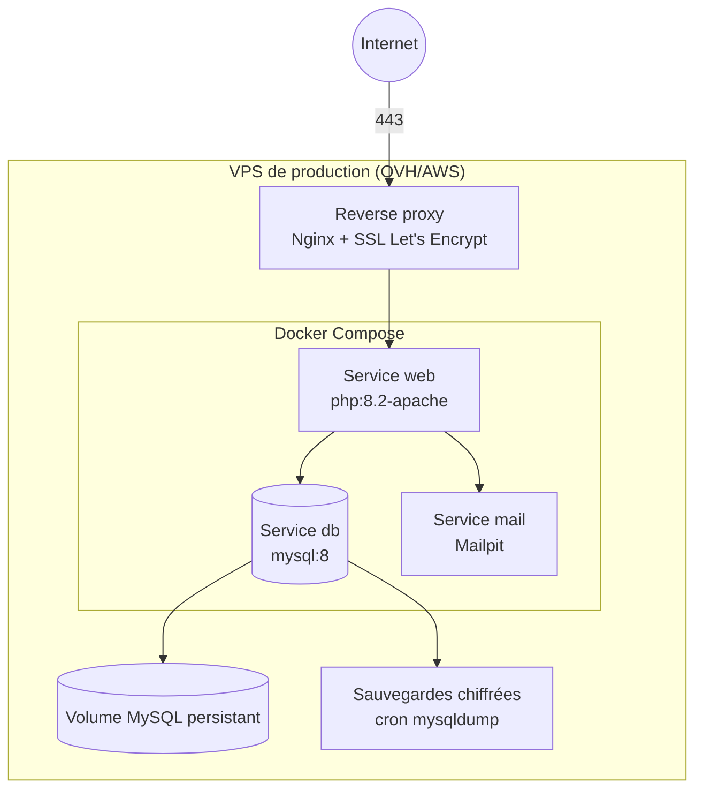

# Document de Conception Technique (DCT)

**Projet fil rouge — Plateforme e-commerce & gestion SaaS « Cyna »**
Équipe : Adrien CACHOUX · Romain CANER · Ethan MIRBEAU
Version 1.0 — Bloc 2/3

---

## Table des matières

1. [Objet du document](#1-objet-du-document)
2. [Vue d'ensemble de la solution](#2-vue-densemble-de-la-solution)
3. [Architecture du système](#3-architecture-du-système)
4. [Diagrammes techniques](#4-diagrammes-techniques)
   - 4.1 [Architecture globale](#41-diagramme-darchitecture-globale)
   - 4.2 [Modèle de données (MCD/MPD)](#42-modèle-de-données)
   - 4.3 [Flux de données — tunnel de commande](#43-diagramme-de-flux-de-données--tunnel-de-commande)
   - 4.4 [Communication des services](#44-diagramme-de-communication-des-services)
   - 4.5 [Diagramme de déploiement](#45-diagramme-de-déploiement)
5. [Choix technologiques et justifications](#5-choix-technologiques-et-justifications)
6. [Plan de sécurité](#6-plan-de-sécurité)
7. [Plan de maintenance et d'évolutivité](#7-plan-de-maintenance-et-dévolutivité)
8. [Stratégie de tests et de recette](#8-stratégie-de-tests-et-de-recette)
9. [Annexes](#9-annexes)

---

## 1. Objet du document

Ce document décrit l'architecture technique de la plateforme Cyna, les choix
d'ingénierie retenus et leur justification, le modèle de données, les mesures de
sécurité et le plan de maintenance. Il constitue le livrable **DCT** exigé par la
note de cadrage (§1.1) et le cahier des charges (§XIX-5).

Le périmètre fonctionnel validé (matrice MoSCoW de la note de cadrage §4.3)
exclut explicitement l'application mobile native (remplacée par un site
**responsive mobile-first**) et le chatbot.

## 2. Vue d'ensemble de la solution

La solution est un **système d'information transverse** composé de trois pôles
interconnectés autour d'une base de données MySQL unique :

| Pôle | Composant | Technologie | Utilisateurs |
|------|-----------|-------------|--------------|
| Applicatif web | Site e-commerce + back-office | PHP 8.2 natif, HTML/CSS/JS | Clients, visiteurs, administrateurs |
| Applicatif lourd | Panneau d'administration interne | Java 17 Swing | Administrateurs (gestion stock/commandes) |
| Données | Base relationnelle | MySQL 8 (InnoDB, utf8mb4) | — |
| Infrastructure | Conteneurisation | Docker / Docker Compose | Exploitation |

Les deux applications (web PHP et lourde Java) accèdent à la **même base
MySQL**, garantissant la cohérence des données (produits, commandes,
abonnements) entre l'espace client et la gestion interne.

## 3. Architecture du système

Le site web suit une architecture **MVC en couches**, sans framework, reposant
sur un noyau maison (`src/Core`) :

- **Point d'entrée unique** (`public/index.php`) → *front controller* qui délègue
  au `Kernel`.
- **Routeur** (`Core/Router`) : associe une méthode HTTP + un chemin à une action
  de contrôleur, avec support des groupes et des middlewares.
- **Middlewares** (`Middleware/`) : CSRF, authentification, contrôle d'accès admin
  (chaîne de responsabilité exécutée avant le contrôleur).
- **Contrôleurs** (`Controllers/Front`, `Controllers/Admin`) : orchestrent la
  requête, ne contiennent pas de logique métier lourde.
- **Services** (`Services/`) : logique métier (panier, recherche, paiement,
  authentification, génération de factures PDF).
- **Repositories** (`Repositories/`) : accès aux données via PDO + requêtes
  préparées ; une classe par agrégat métier.
- **Vues** (`resources/views`) : gabarits PHP (layouts, partials) avec échappement
  systématique.



**Séparation des responsabilités (SoC)** : chaque couche a une responsabilité
unique et ne connaît que la couche immédiatement inférieure, ce qui facilite les
tests unitaires (services et noyau testés indépendamment de HTTP et de la base).

## 4. Diagrammes techniques

### 4.1 Diagramme d'architecture globale



### 4.2 Modèle de données

Base **MySQL 8 / InnoDB / utf8mb4**. Montants stockés en **centimes** (entiers)
pour éviter toute imprécision de calcul. Les valeurs d'énumération (statuts,
périodicités) restent en anglais comme identifiants techniques.



> Tables complémentaires non représentées : `diapositives_accueil` (carrousel
> éditable), `reglages` (clé/valeur : texte fixe de l'accueil…), `messages_contact`
> (formulaire de contact).

**Points de conception notables :**

- `commandes` conserve un **instantané** de l'adresse de facturation et des
  informations de paiement (marque + 4 derniers chiffres) : la facture reste
  fidèle même si l'utilisateur modifie ensuite son carnet d'adresses.
- `lignes_commande.produit_id` et `commandes.utilisateur_id` passent à `NULL`
  (ON DELETE SET NULL) si le produit/utilisateur est supprimé, préservant
  l'historique et les factures.
- Les données de carte ne sont **jamais** stockées : seul un identifiant opaque
  Stripe (`stripe_pm_id`, `stripe_payment_intent`) est conservé.

### 4.3 Diagramme de flux de données — tunnel de commande



### 4.4 Diagramme de communication des services



### 4.5 Diagramme de déploiement



## 5. Choix technologiques et justifications

| Composant | Choix | Justification |
|-----------|-------|---------------|
| Backend web | **PHP 8.2 natif** (sans framework) | Maîtrise de l'équipe ; empreinte mémoire/CPU réduite vs Symfony/Laravel pour un projet de cette taille (démarche Green IT, note de cadrage §9.1) ; contrôle total du noyau (routeur, sécurité, i18n). |
| Frontend | **HTML5 / CSS3 / JS natif** + design system maison | Standards universels, aucune dépendance lourde, contrôle de l'accessibilité (WCAG 2.1 AA) et des performances. |
| Base de données | **MySQL 8 (InnoDB)** | Base relationnelle mature, transactions ACID indispensables au tunnel de commande, partage entre PHP et Java. |
| Application interne | **Java 17 Swing** | Client riche pour les administrateurs, sans navigateur, adapté à des postes reconditionnés. |
| Paiement | **Stripe** (API REST via cURL, sans SDK) | Conformité PCI-DSS, tokenisation, mode test ; repli simulé sans clés pour la démonstration. |
| 2FA | **TOTP RFC 6238** (implémenté à la main côté PHP, `googleauth` côté Java) | Compatible Google Authenticator/Authy, aucune dépendance runtime côté web. |
| E-mails | **Client SMTP maison** (compatible Mailpit) | Confirmation d'inscription, réinitialisation, notifications de commande. |
| Conteneurisation | **Docker / Docker Compose** | Déploiement reproductible et isolé, standard industriel du CI/CD. |
| Tests | **PHPUnit** (web) · **JUnit 5** (Java) | Frameworks standards des deux écosystèmes. |
| Versionnement | **Git / GitHub** (deux dépôts distincts) | Traçabilité, une branche par fonctionnalité, revue avant fusion. |

> **Note sur les dépendances :** conformément à la note de cadrage, le *runtime*
> web n'a **aucune dépendance externe**. PHPUnit est installé en `require-dev`
> uniquement et n'est jamais déployé en production.

## 6. Plan de sécurité

La sécurité est traitée *by design*, à chaque couche. Correspondance avec les
exigences de la note de cadrage (§5.3) :

| Menace / exigence | Mesure implémentée | Emplacement |
|-------------------|--------------------|-------------|
| Injection SQL | Requêtes préparées PDO, paramètres liés, aucune concaténation | `Core/Database`, tous les `Repositories` |
| XSS | Échappement `htmlspecialchars` systématique via `e()` ; en-tête **CSP** | `helpers.php` (`e`), `Response` |
| CSRF | Jeton unique par session, champ `_token`, vérification `hash_equals` | `Core/Csrf`, `Middleware/VerifyCsrf` |
| Clickjacking | En-tête `X-Frame-Options: SAMEORIGIN`, `X-Content-Type-Options: nosniff` | `Core/Response` |
| Mots de passe | Hachage **bcrypt** (`password_hash`), coût ≥ 10 | `Services/Auth`, `Models/User` |
| Sessions | Cookies `httponly` + `secure` (HTTPS) + `samesite=Lax` ; régénération d'ID après login | `Core/Session` |
| Jetons e-mail | Générés cryptographiquement, validité 24 h, invalidés après usage | `Services/Auth` |
| 2FA admin | TOTP obligatoire à la connexion back-office | `Core/Totp`, `CredentialUtils` (Java) |
| Données de carte | Tokenisation Stripe, aucun numéro stocké en clair | `Services/PaymentService`, schéma BDD |
| RGPD | Pages CGU/confidentialité, politique de rétention documentée | `Controllers/Front/PageController` |
| Transport | HTTPS obligatoire, certificat Let's Encrypt | Reverse proxy (infra) |

**Tests de sécurité** : voir le [Cahier de recettes](CAHIER_DE_RECETTES.md) —
scénarios d'injection SQL, XSS, vérification CSRF, tentative d'accès admin non
authentifié, robustesse du mot de passe et de la 2FA (KPI : *100 % des failles
cibles couvertes par un test documenté*).

## 7. Plan de maintenance et d'évolutivité

### 7.1 Maintenance corrective et évolutive

- **Gestion de version** : Git Flow simplifié (`main` = production, `develop` =
  intégration, une branche `feature/*` par ticket Jira). Fusion uniquement après
  revue de code par un autre membre.
- **Intégration continue** : pipeline GitHub Actions exécutant à chaque *push* le
  lint PHP, la suite PHPUnit et les tests JUnit (voir `.github/workflows/ci.yml`).
- **Correctifs de sécurité** : suivi des CVE des images Docker de base ;
  reconstruction périodique des conteneurs.

### 7.2 Scalabilité

- **Base de données** : index sur les colonnes de tri/filtre (`idx_produits_tri`,
  `idx_commandes_date`…). Possibilité de réplication lecture/écriture.
- **Application web** : sans état côté serveur au-delà de la session (stockable en
  Redis pour une montée en charge horizontale derrière un répartiteur).
- **Assets** : images en **WebP**, pagination obligatoire des listes, mise en
  cache statique — objectif temps de réponse < 2 s (note de cadrage §4.4).

### 7.3 Sauvegarde et reprise d'activité

- `mysqldump` planifié (cron) avec rétention glissante — voir
  [`INFRA_SAUVEGARDE_SSL.md`](INFRA_SAUVEGARDE_SSL.md).
- Volume MySQL persistant ; procédure de restauration documentée et testée.

### 7.4 Pistes d'évolution (backlog *Could Have*)

Promotions/codes de réduction, détection de fraude, rapports d'administration
exportables, ajout de langues RTL (arabe/hébreu — socle technique déjà en place
via l'attribut `dir` dynamique).

## 8. Stratégie de tests et de recette

| Niveau | Outil | Portée | Emplacement |
|--------|-------|--------|-------------|
| Unitaire (web) | PHPUnit 11 | Noyau (TOTP, Validator, Paginator, CSRF), services (Cart), helpers | `Cyna/tests/Unit` |
| Unitaire (Java) | JUnit 5 | Sécurité de l'authentification (bcrypt, TOTP) | `src/test/java` |
| Intégration | Manuel (cahier de recettes) | Parcours d'achat complet, sécurité | [`CAHIER_DE_RECETTES.md`](CAHIER_DE_RECETTES.md) |

Commandes :

```bash
# Web (depuis Cyna/)
composer install
composer test

# Java (depuis la racine)
mvn test
```

## 9. Annexes

- [Cahier de recettes](CAHIER_DE_RECETTES.md)
- [Documentation de l'API (OpenAPI/Swagger)](api/openapi.yaml)
- [Manuel utilisateur](MANUEL_UTILISATEUR.md)
- [Guide d'installation](../Cyna/docs/INSTALLATION.md)
- [Architecture applicative détaillée](../Cyna/docs/ARCHITECTURE.md)
- [Infrastructure : sauvegardes & SSL](INFRA_SAUVEGARDE_SSL.md)
- [Guide de séparation des dépôts Git](GUIDE_SEPARATION_REPOS.md)
